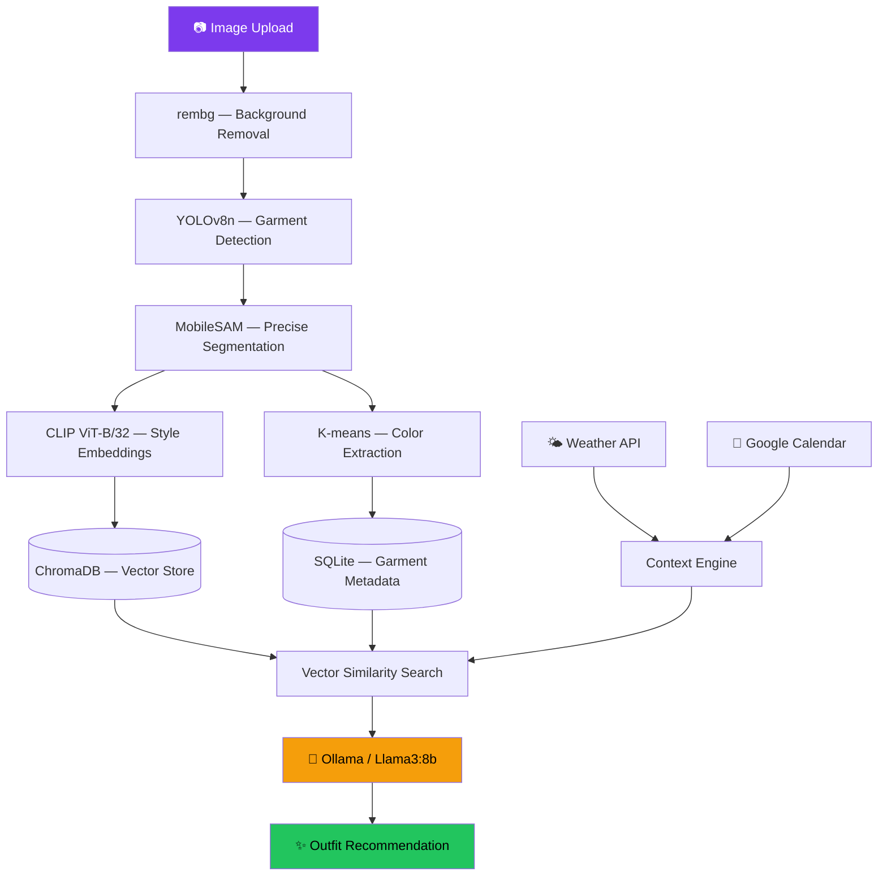

<div align="center">

# 👗 The Stylist's Brain

**Your wardrobe, analyzed by 5 AI models. Your outfits, chosen by an LLM.**
**100% local. 100% private. Zero cloud APIs.**

[](https://python.org)
[](https://fastapi.tiangolo.com)
[](https://docs.ultralytics.com)
[](https://openai.com/clip)
[](https://ollama.ai)
[](LICENSE)
[](https://github.com/Vaishnavi-Dubey/stylist-brain/actions)

</div>

---

## ⚡ What This Actually Does

Upload a photo of a garment. The system:

1. **Removes the background** → rembg / U2Net
2. **Detects the garment** → YOLOv8 nano
3. **Segments it precisely** → MobileSAM
4. **Extracts dominant colors** → K-means clustering
5. **Generates semantic embeddings** → CLIP ViT-B/32
6. **Stores it in a vector database** → ChromaDB
7. **Checks today's weather** → OpenWeatherMap API
8. **Reads your calendar** → Google Calendar API
9. **Asks an LLM to style you** → Ollama / Llama3:8b

All running **locally** on your machine. No data leaves your laptop.

---

## 🏗️ Architecture



---

## 🚀 Why This Stands Out

| Feature | Why It Matters |
|---|---|
| **5-model pipeline** | Not a single-model demo — orchestrates YOLO + SAM + CLIP + U2Net + LLM in sequence |
| **Privacy-first** | All inference runs locally via Ollama. Your wardrobe data never touches the cloud |
| **Video intake** | Scan your entire closet by walking past it with your phone camera |
| **Wardrobe intelligence** | Gap analysis, wearing pattern tracking, and outfit history |
| **Context-aware** | Checks weather + calendar events before suggesting outfits |
| **Not a wrapper** | The LLM reasons about color theory, weather, occasion, and your wardrobe history — not just random picks |

---

## 🛠️ Quick Start

### Prerequisites

- Python 3.10+
- [Ollama](https://ollama.ai) installed (`brew install ollama`)
- An LLM model pulled (`ollama pull llama3:8b`)

### Setup

```bash
# Clone
git clone https://github.com/Vaishnavi-Dubey/stylist-brain.git
cd stylist-brain

# Environment setup (creates venv, installs deps)
bash setup.sh

# Download model weights (YOLOv8n, MobileSAM)
bash download_models.sh

# Configure API keys
cp .env.example .env
# → Add your OpenWeatherMap key (free tier)

# Launch
bash run.sh
# → Opens http://localhost:8000
```

### Docker (one command)

```bash
docker-compose up --build
# → Backend: http://localhost:8000
# → API docs: http://localhost:8000/docs
```

---

## 📂 Project Structure

```
stylist-brain/
├── backend/
│   ├── main.py              # FastAPI entry — lifespan, routers, static mounts
│   ├── check.py             # Pre-flight health checks
│   ├── intake/              # ── CV PIPELINE ──
│   │   ├── routes.py        # /intake/* API endpoints
│   │   ├── pipeline.py      # Orchestrates the full intake flow
│   │   ├── detect.py        # YOLOv8n garment detection
│   │   ├── segment.py       # MobileSAM segmentation masks
│   │   ├── sam_refine.py    # SAM mask post-processing
│   │   ├── embed.py         # CLIP ViT-B/32 embedding generation
│   │   ├── tag.py           # Garment attribute tagging
│   │   ├── video.py         # Video frame extraction for closet scanning
│   │   └── test_intake.py   # Intake pipeline tests
│   ├── imaging/             # ── VISUALIZATION ──
│   │   ├── generate.py      # Outfit image composition
│   │   └── flatlay.py       # Flat-lay style arrangement generator
│   ├── styling/             # ── RECOMMENDATION ENGINE ──
│   │   ├── routes.py        # /styling/* API endpoints
│   │   ├── llm.py           # Ollama/Llama3 integration for outfit reasoning
│   │   ├── query.py         # ChromaDB vector similarity queries
│   │   ├── gap.py           # Wardrobe gap analysis ("you need formal shoes")
│   │   └── habits.py        # Wearing pattern tracking
│   ├── context/             # ── ENVIRONMENTAL AWARENESS ──
│   │   ├── routes.py        # /context/* API endpoints
│   │   ├── weather.py       # OpenWeatherMap integration
│   │   └── calendar.py      # Google Calendar event parsing
│   └── db/                  # ── DATA LAYER ──
│       ├── sqlite.py        # Structured garment metadata
│       └── chroma.py        # CLIP vector embeddings store
├── frontend/
│   └── index.html           # Lightweight web UI
├── download_models.sh       # Fetches YOLO + MobileSAM weights
├── setup.sh                 # Environment + dependency setup
├── run.sh                   # One-command server launch
├── docker-compose.yml       # Container orchestration
├── Dockerfile               # Production image
├── requirements.txt         # Pinned Python dependencies
├── .env.example             # Environment variable template
├── CONTRIBUTING.md          # Contribution guidelines
└── LICENSE                  # MIT License
```

---

## 📊 Tech Stack

| Layer | Technology | Role |
|---|---|---|
| **API** | FastAPI + Uvicorn | Async REST server with auto-generated OpenAPI docs |
| **Detection** | YOLOv8 nano | Garment bounding box detection |
| **Segmentation** | MobileSAM | Pixel-precise garment mask extraction |
| **Embeddings** | CLIP ViT-B/32 | Semantic style vector generation |
| **Background** | rembg (U2Net) | Clean garment isolation from photos |
| **Colors** | K-means (scikit-learn) | Dominant color palette extraction |
| **Vector DB** | ChromaDB | Style similarity search at scale |
| **Metadata DB** | SQLite | Garment attributes, history, and wear tracking |
| **LLM** | Ollama (Llama3:8b) | Natural language outfit reasoning |
| **Weather** | OpenWeatherMap API | Temperature-aware outfit suggestions |
| **Calendar** | Google Calendar API | Event-appropriate styling |

---

## 📡 API Reference

The server exposes auto-generated Swagger docs at [`/docs`](http://localhost:8000/docs).

| Method | Endpoint | Description |
|---|---|---|
| `POST` | `/intake/upload` | Upload garment image for analysis |
| `POST` | `/intake/video` | Upload closet scan video |
| `GET` | `/intake/wardrobe` | List all wardrobe items |
| `POST` | `/styling/outfit` | Generate outfit recommendation |
| `GET` | `/styling/history` | View past outfit suggestions |
| `GET` | `/styling/gaps` | Analyze wardrobe gaps |
| `GET` | `/context/weather` | Current weather conditions |
| `GET` | `/health` | Service health check |

---

## 📈 Impact & Highlights

- **Multi-Model Orchestration** — Chains 5 AI models (YOLO → SAM → CLIP → U2Net → Llama3) in a single inference pipeline
- **CPU Optimized** — Uses nano/lightweight variants (YOLOv8n, ViT-B/32, MobileSAM) for MacBook Air–grade hardware
- **Production Architecture** — Clean separation: intake → imaging → context → styling, each with independent routes
- **Dual Database** — SQLite for structured metadata + ChromaDB for vector similarity — each storage engine plays to its strength
- **Advanced CV** — Combines object detection, semantic segmentation, embedding search, and color clustering
- **Video Intake** — Frame extraction from closet walkthrough videos for bulk wardrobe scanning

---

## 🤝 Contributing

Contributions welcome! See [CONTRIBUTING.md](CONTRIBUTING.md) for guidelines.

```bash
git checkout -b feature/your-feature
git commit -m 'Add: new feature'
git push origin feature/your-feature
# → Open a Pull Request
```

---

## 📜 License

MIT — see [LICENSE](LICENSE) for details.

Built with ❤️ by [Vaishnavi Dubey](https://github.com/Vaishnavi-Dubey)
